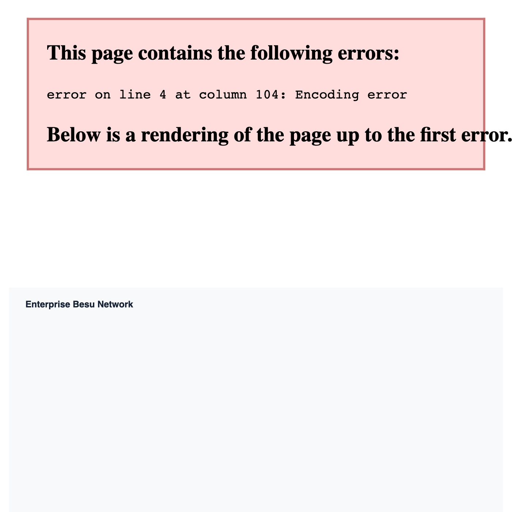
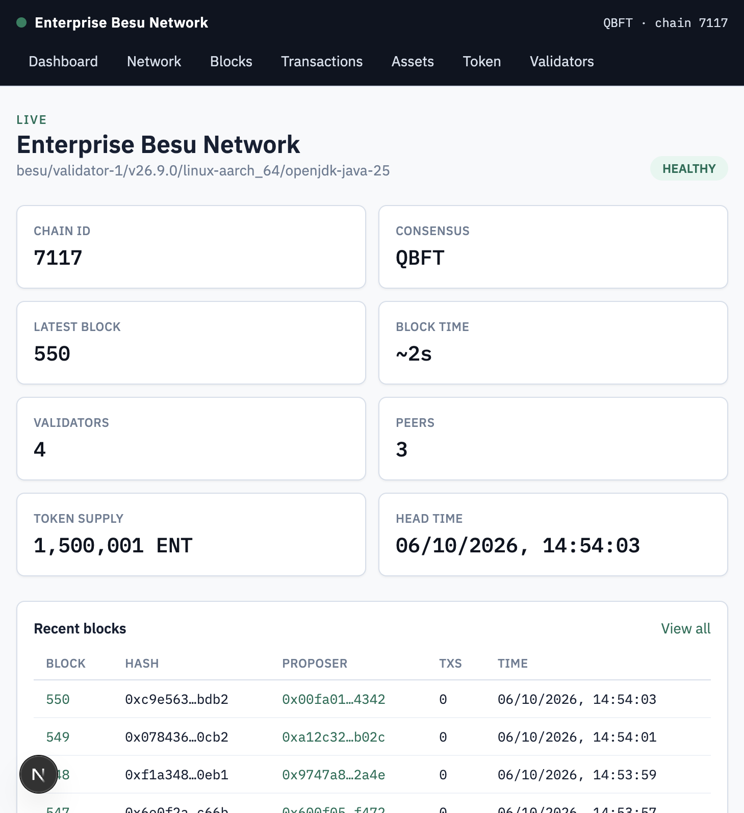
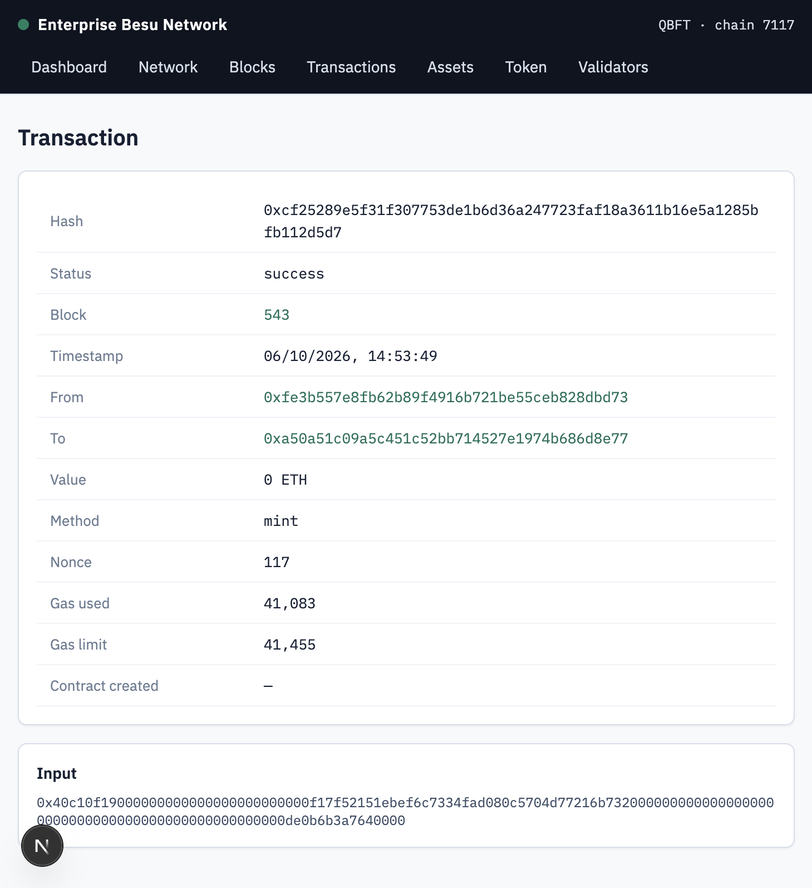
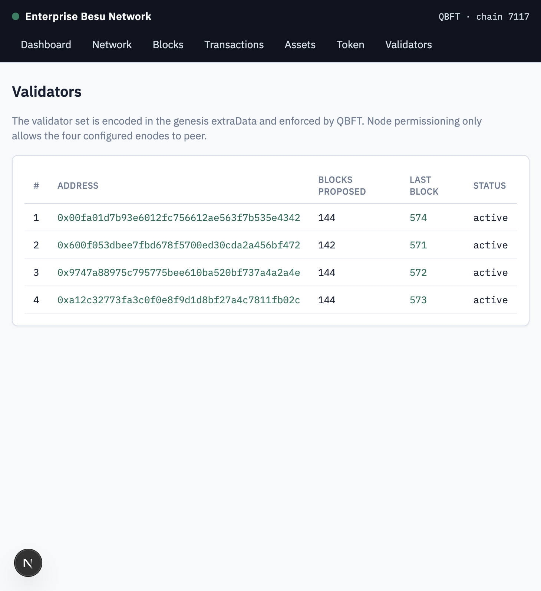
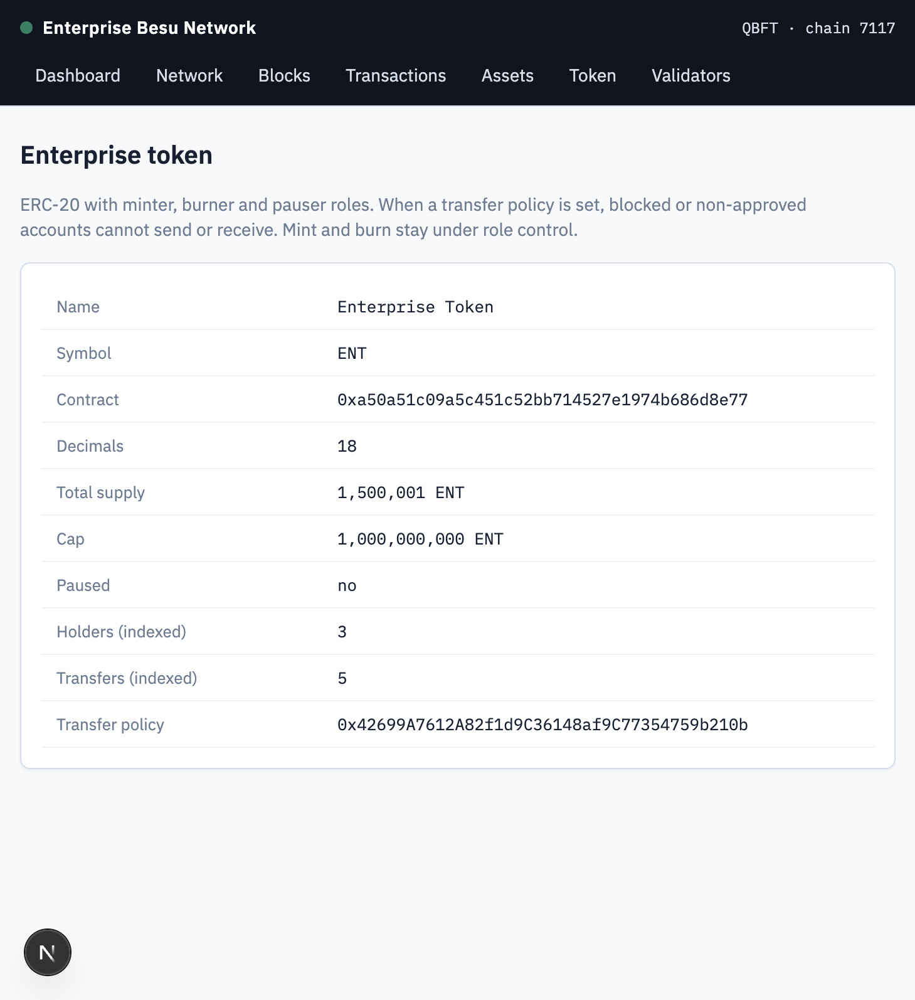
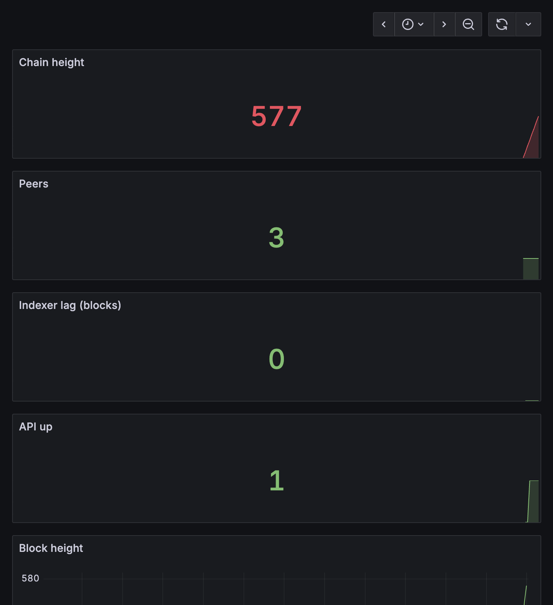

# Enterprise EVM Network — Hyperledger Besu

A permissioned, Ethereum-compatible network: four Hyperledger Besu validators running QBFT, a Solidity suite (token, asset registry, transfer policy), a TypeScript API, a restart-safe PostgreSQL indexer, a Next.js dashboard with a block explorer, and Prometheus/Grafana.

This is **production-style portfolio infrastructure**. It has the controls you would expect in a private deployment (permissioning, a trimmed RPC surface, TLS and firewall sketches, idempotent indexing, structured logs). It has not had an external security audit, and it is not claimed to be production-secure.

The network in this repository runs locally in Docker. Cloud deployment is scripted in `infrastructure/` and `docs/deployment.md`. It was not pointed at a VPS during this build, because that needs your servers and a domain.

## Architecture

```text
Users
  |
  +-- Next.js dashboard and explorer   (localhost:3001)
  |
  +-- Grafana                          (localhost:3300)
          |
          v
     Fastify API                       (localhost:4000)
          |  JSON-RPC
          v
   validator-1 .. validator-4          QBFT, chain id 7117, ~2s blocks
          |
          +-- Indexer --> PostgreSQL
          +-- Prometheus
```



Details: [docs/architecture.md](docs/architecture.md).

## Why Besu

Besu is a Java Ethereum client that speaks the same JSON-RPC and runs the same EVM as a public chain, so Solidity, Hardhat and ethers.js work unchanged. On a private network it adds the pieces a public client does not:

- **QBFT**, a BFT consensus with immediate finality and an explicit validator set.
- **Node permissioning**, so only the configured enodes can peer.
- **A configurable RPC surface**, so administrative methods stay off the network.
- **Prometheus metrics** for height, peers, JVM and RPC.

## Consensus

Four validators satisfy `N = 3f + 1` with `f = 1`. The chain keeps finalising blocks if one validator is down or Byzantine, and it cannot tolerate two. Parameters and the reasoning are in [docs/qbft.md](docs/qbft.md). The failure test that stops validator 4 and brings it back is in [docs/failure-testing.md](docs/failure-testing.md).

## Local setup

Requirements: Docker, Node.js 20, npm 10.

```bash
git clone <repo>
cd enterprise-EVM-network
cp .env.example .env

docker compose up -d
npm install
npm run contracts:compile
npm run contracts:test
npm run db:migrate
npm run contracts:deploy
npm run seed:besu -w contracts
npm run dev
```

`npm run dev` starts the API (port 4000), the indexer (metrics on 4100) and the dashboard (port 3001).

What you should see:

| Check | Where |
| --- | --- |
| Chain id 7117, 3 peers, blocks every ~2s | `bash scripts/health-check.sh` |
| Dashboard | http://localhost:3001 |
| API docs | http://localhost:4000/docs |
| Grafana (`admin` / `admin_dev_password`) | http://localhost:3300 |

The dev genesis prefunds three well-known Besu accounts. Their private keys are public. They exist so `npm run contracts:deploy` works with no manual key ceremony. Do not reuse them anywhere but this local network. See [docs/security.md](docs/security.md).

Regenerating validator keys (only if you intend to wipe the chain):

```bash
rm -rf besu/keys
bash besu/scripts/generate-network.sh dev
docker compose down -v
docker compose up -d
```

## Deployment

Validators and the application server are separate. Each validator runs `infrastructure/systemd/besu-validator.service` with `besu/config/validator.prod.toml`. The API, indexer, Postgres, frontend and monitoring run from `infrastructure/deployment/docker-compose.prod.yml` behind Nginx and Let's Encrypt (`infrastructure/nginx/besu.conf`). Firewall sketches are in `infrastructure/firewall/`.

The full sequence, including what is still operator work (DNS, SSH secrets, real keys), is [docs/deployment.md](docs/deployment.md).

## Smart contracts

| Contract | Role |
| --- | --- |
| `EnterpriseToken` | ERC-20 with minter, burner and pauser roles, plus an optional transfer policy |
| `AssetRegistry` | Register, update, transfer and deactivate enterprise assets |
| `PermissionedTransfer` | Blocklist, and an optional allowlist, consulted by the token and the registry |

OpenZeppelin `AccessControl` and `Pausable` are used instead of a hand-rolled owner check. Tests: `npm run contracts:test` (48 passing). Description: [docs/contracts.md](docs/contracts.md).

## API

JSON envelopes are `{ "success": true, "data": ... }` or `{ "success": false, "error": { "code", "message" } }`. Writes require `X-API-Key` and accept `Idempotency-Key`. A repeated key returns the original transaction and does not send another one.

Endpoint list: [docs/api.md](docs/api.md). Interactive schema: http://localhost:4000/docs.

Transaction states:

```text
REQUESTED -> SUBMITTED -> PENDING -> MINED -> CONFIRMED
                 \                      \
                  +--------> FAILED <----+
```

A transaction that already has a hash is never re-broadcast. A timeout leaves it `PENDING`.

## Monitoring

Prometheus scrapes Besu, the API, the indexer and a node exporter. Grafana loads the "Besu Enterprise Network" dashboard automatically. Alert rules cover a dead validator, zero peers, a stalled chain, indexer lag, disk space, and a dead API or indexer. [docs/monitoring.md](docs/monitoring.md).

## Security

Node permissioning, a production RPC allowlist that drops `ADMIN`/`DEBUG`/`TRACE`, write-key authentication, rate limiting, Zod validation, parameterised SQL, and firewall sketches. Secrets stay in `.env`, which is gitignored. The committed validator keys under `besu/keys/dev` are a local development set and are labelled as such.

Limitations are written down in [docs/security.md](docs/security.md). Read that before exposing any of this to the internet.

## Failure testing

Ran locally against the Docker network on 6 Oct 2026:

1. All four validators up, height 485, validator-1 had 3 peers.
2. `validator-4` stopped. Height moved 488 → 491. Peers on validator-1 dropped to 2 (the remaining quorum).
3. `validator-4` started again. Peers returned to 3 at height 493.

`bash scripts/failure-test.sh` repeats this. Restart behaviour of the API, indexer and database is in [docs/failure-testing.md](docs/failure-testing.md).

## Performance

Measured on an Apple M4, 16 GB RAM, Docker Desktop, Besu 26.9.0. Block interval was 2.0 seconds across the sampled blocks. Inclusion latency is dominated by that block time, not by EVM execution.

| Transactions | Elapsed | Throughput | p50 | p95 | p99 |
| --- | --- | --- | --- | --- | --- |
| 100 | 16.99 s | 5.89 tx/s | 3779 ms | 4176 ms | 4278 ms |
| 500 | 83.07 s | 6.02 tx/s | 3909 ms | 4123 ms | 4159 ms |
| 1000 | 165.90 s | 6.03 tx/s | 3916 ms | 4121 ms | 4164 ms |

API read latency on the same machine: `/blocks` p50 3 ms, `/network` p50 15 ms (it fans out to several RPC calls). Indexer lag on the Grafana dashboard was 0 blocks once caught up. [docs/performance.md](docs/performance.md).

## Live demo

The local demo is http://localhost:3001 once `npm run dev` is running. A public hostname is not attached yet. When you have a domain, point `besu.example.com`, `api.example.com` and `grafana.example.com` as described in [docs/deployment.md](docs/deployment.md). Do not publish validator RPC.

## Screenshots

Taken against the running local network.











## Repository layout

```text
contracts/          Solidity, Hardhat tests, deploy and seed scripts
besu/               genesis, validator config, permissioning, key generation
apps/api            Fastify API
apps/indexer        block and event indexer
apps/frontend       dashboard and explorer
packages/db         Drizzle schema and migrations
packages/shared     ABIs and shared response types
monitoring/         Prometheus, alert rules, Grafana dashboard
infrastructure/     Dockerfiles, Nginx, systemd, firewall, prod compose
scripts/            setup, health, failure test, benchmark, backup
docs/               the write-up linked above
```

## Licence

MIT.
